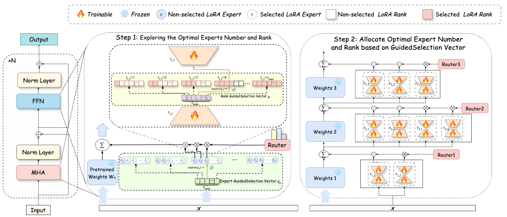

# GuiLoMo: Allocating Experts and Ranks for LoRA-MoE via Bilevel Optimization with GuidedSelection Vectors
This is the code repository of "GuiLoMo: Allocating Experts and Ranks for LoRA-MoE via Bilevel Optimization with GuidedSelection Vectors".


# 🚀 Introduction

Parameter-efficient fine-tuning (PEFT) methods, particularly Low-Rank Adaptation (LoRA), offer an efficient way to adapt large language models with reduced computational costs. However, their performance is limited by the small number of trainable parameters. Recent work combines LoRA with the Mixture-of-Experts (MoE), i.e., LoRA-MoE, to enhance capacity, but its full potential remains underexplored. Existing methods often overlook two key factors: 1) the influence of downstream tasks when assigning expert numbers, and 2) the uniform rank assignment across all LoRA experts, which restricts representational diversity.
To mitigate these gaps, we propose GuiLoMo, a fine-grained layer-wise expert numbers and ranks allocation strategy with GuidedSelection Vectors (GSVs). GSVs are learned via a prior bilevel optimization process to capture both model- and task-specific needs, and are then used to allocate optimal expert numbers and ranks.




## Install
The installation is for Linux
1. Install dependencies
   ```bash
   conda create -n guilomo python=3.10 -y
   conda activate guilomo
   pip install -r requirements.txt
   ```
## Data Preparation Scripts
We take ScienceQA as an example, which can be applied to customized datasets as well.   
```bash
python preprocess/preparation_scienceqa_data.py \
         --save_path "./scienceqa"
```

The processed data sample should contain four essential components `instruction`, `input`, and `output` are used for downstream task instruction tuning. `answer` is used in evaluation only.

| <!-- -->    | <!-- -->    |
| --- | --- |
| instruction | The question and the choices. (`Question: ...? Options: (A) ... (B) ...`) |
| input | Not used in this situation.|
| output | The answer (`Answer: The answer is B.`) |
| answer | The answer to the question which is used for evaluation. (`B`)|

## Training
We divide the training process into two stages. The first stage is exploring the optimal experts number and rank, and the second stage is performing SFT (Supervised Fine-Tuning) under the selected Expert Number and Rank configuration. `ArMoLA` is the directory we use to search for the Expert Number and Rank, while `MoLA_con` is the directory where we perform training after determining the Expert Number and Rank.

### 1. Exploring the Optimal Experts Number and Rank
`mola_weights_dir` specifies the path where the model is saved, and `task_name` specifies the name of the dataset.
We will perform this optimization step under the `ArMoLA` directory on `task_name` data:
```bash
CUDA_VISIBLE_DEVICES=0,1,2,3 python mola_training.py \
         --base_model "NousResearch/Llama-2-7b-hf" \
         --data_path "dataset_path/${task_name}.hf" \
         --output_dir $mola_weights_dir \
         --batch_size 64 \
         --micro_batch_size 16 \
         --num_epochs 4 \
         --learning_rate 3e-4 \
         --cutoff_len 256 \
         --val_set_size 1 \
         --lora_r "8, 8, 8, 8, 8, 8, 8, 8, 8, 8, 8, 8, 8, 8, 8, 8, 8, 8, 8, 8, 8, 8, 8, 8, 8, 8, 8, 8, 8, 8, 8, 8" \
         --lora_alpha 16 \
         --lora_dropout 0.05 \
         --lora_target_modules "q_proj,k_proj,v_proj,o_proj,gate_proj,down_proj,up_proj" \
         --number_experts "8, 8, 8, 8, 8, 8, 8, 8, 8, 8, 8, 8, 8, 8, 8, 8, 8, 8, 8, 8, 8, 8, 8, 8, 8, 8, 8, 8, 8, 8, 8, 8" \
         --top_k "2,2,2,2,2,2,2,2,2,2,2,2,2,2,2,2,2,2,2,2,2,2,2,2,2,2,2,2,2,2,2,2" \
         --train_on_inputs \
         --group_by_length \
         --add_eos_token \
         --obalance True \
```
Obtain the optimal number of experts and rank using the following script: 
```bash
python save_rankandexp_num.py --dir $mola_weights_dir --json_name $task_name
```

### 2. Train the Model under the Optimal Expert Number and Rank Configuration
`exprank_jsons_${task_name}` is the directory for storing the Expert and Rank settings. `$last_name` is the filename used to save or load the model. We will `cd MoLA_con` and then execute the following training script: 
```bash
CUDA_VISIBLE_DEVICES=0,1,2,3 python mola_training.py \
        --base_model "model_path" \
        --data_path "dataset_path/${task_name}.hf" \
        --output_dir "models_con/$task_name/$last_name" \
        --batch_size 64 \
        --micro_batch_size 16 \
        --num_epochs 20 \
        --learning_rate 3e-4 \
        --cutoff_len 256 \
        --val_set_size 1 \
        --lora_r "../exprank_jsons_${task_name}/$last_name/rank.json" \
        --lora_alpha 16 \
        --lora_dropout 0.05 \
        --lora_target_modules "q_proj,k_proj,v_proj,o_proj,gate_proj,down_proj,up_proj" \
        --number_experts "../exprank_jsons_$task_name/$last_name/expert.json" \
        --top_k "2,2,2,2,2,2,2,2,2,2,2,2,2,2,2,2,2,2,2,2,2,2,2,2,2,2,2,2,2,2,2,2" \
        --train_on_inputs \
        --group_by_length \
        --add_eos_token \
        --obalance True \
```

## Evaluation on ScienceQA
We support the evaluation of batch samples.
```bash
python evaluation_scienceqa.py \
         --test_dataset "./scienceqa/scienceq_test.json" \
         --base_model "NousResearch/Llama-2-7b-hf" \
         --mola_weights "models_con/$task_name/$last_name" \
         --batch_size 8 \
         --lora_target_modules "q_proj,v_proj,k_proj,o_proj,gate_proj,down_proj,up_proj" \
         --number_experts "../exprank_jsons_$task_name/$last_name/expert.json" \
         --top_k "2,2,2,2,2,2,2,2,2,2,2,2,2,2,2,2,2,2,2,2,2,2,2,2,2,2,2,2,2,2,2,2" \
         --save_path "./results/$task_name/$last_name.json"
```

# Acknowlegements

The code is developed based on [MoLA](https://github.com/GCYZSL/MoLA.git) and [darts](https://github.com/quark0/darts.git) projects.

